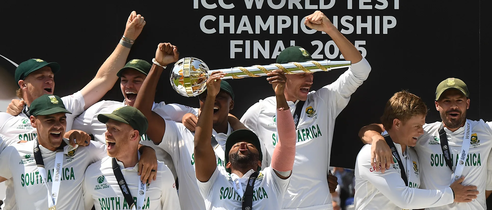

<span style="font-style: italic; color: #555;">
Why Temba Bavuma lifting the WTC mace is a powerful symbol: A numerical analysis of South African captains' tenures over major global cricket tournaments.
</span>

```{r bavuma-pic, echo=FALSE, out.width="100%", fig.cap="Bavuma's South Africa beat Australia to win the 2025 World Test Championship"}

```


```{r setup, include=FALSE}
knitr::opts_chunk$set(echo = TRUE)

library(readxl)
library(ggplot2)
library(dplyr)
library(lubridate)
library(stringr)
library(ggrepel)

sa_df <- read_excel("/Users/dipankarlahiri/Desktop/Data Projects/Kohli all-time/Black Captains.xlsx")

```

In December 2014, a couple of months into my full-time career as a journalist, I had the opportunity of framing one of my all-time favourite cricket headlines - 'Temba Bavuma to become first black batsman in history to play for South Africa'. The newsroom thought there might be a mistake, surely there had been black batters before. This line in the article addressed those doubts - 'Despite South Africa's 80% black population, only 5 black players have been fielded by the Proteas in Tests. Makhaya Ntini was the only one among the five to enjoy a long 101-Test career. Fast bowlers Monde Zondeki, Mfuneko Ngam,  Lonwabo Tsotsobe and wicketkeeper Thami Tsolekile managed a combined total of 17 Tests'. 

Since then, though there have been more black players breaking through - this week's WTC final XI had three, all of whom can be called fixtures in the current team - news on racial diversity within South Africa's cricket team has not always been positive. Former heroes like Graeme Smith, Mark Boucher, AB de Villiers have been among those accused of trying to keep black players out. And each year has seen South Africa find new ways to exit prematurely. The picture of Temba Bavuma - South Africa's first black captain - holding the World Test Championship mace aloft, ending a 27-year drought for South Africa in global cricket tournaments, was a powerful symbol. What follows is an attempt to track some numbers around South Africa's performance under different captains to understand the power of the symbol.

This analysis covers South Africa's performance in global cricket tournaments from the 1990s. Included are all ICC tournaments — ODI and T20 World Cups, Champions Trophies, and World Test Championship cycles — as well as a few quadrangular tournaments from the 1990s that involved at least four Test-playing nations. A total of 33 tournaments were considered. Each tournament was assigned a performance score based on the stage reached. For major ICC events, the scale was: 5 for a title win, 4 for final, 3 for semi-final, 2 for quarter-final, and 1 for group-stage exit. In the case of the 90s quadrangular series, the scores were downgraded by one point per stage to reflect their lesser stature. Additional variables such as year, tournament name, exit opponent, match margin, and captain are used to explore trends over time and captaincy tenures.

## South Africa in major global cricket events since 1990s

```{r, echo=FALSE, message=FALSE, warning=FALSE}

ggplot(sa_df, aes(x = Year, y = `South Africa's Performance in Global Cricket Events`)) +
  geom_line() +
  geom_point(aes(color = `Drought Status`)) + 
  scale_color_manual(values = c("Title" = "green", "No Title" = "red")) +
  labs(title = "Fig 1: South Africa Tournament Performance Timeline (1991-2024)",
       y = "Stage Score",
       color = "Drought Status") +
  theme_minimal()

ggplot(sa_df, aes(x = Year, y = `South Africa's Performance in Global Cricket Events`, color = Captain)) +
  geom_point(alpha = 0.5) +
  geom_smooth(method = "loess", se = FALSE) +
  labs(title = "Fig 2: Performance Trend by Captain Over Time",
       y = "Stage Score") +
  theme_minimal()

```

**Figure 1** tracks South Africa's performance in 33 ICC tournaments since their re-admission. As can be seen, they had a short period of glory between 1995 and 1998, followed by a long drought before 2025. The three dots in that period represent three titles won under Hansie Cronje's captaincy - a 1995 quadrangular involving Pakistan, Sri Lanka and New Zealand; a 1997 quadrangular involving Pakistan, Sri Lanka and West Indies; and the 1998 Champions Trophy, which involved all Test-playing nations. The '98 title is the only green dot before 2025 which has a score of 5, the two other quadrangular titles were assigned scores of 4. 

**Figure 2** shows the captaincy tenures corresponding to that period. Based on the data on performance in global events, there is an abyss between Cronje and Bavuma's tenures. Graeme Smith and AB de Villiers seem to have been the most successful captains in this period, because there were improvements under them in successive tournaments, but these were followed by drops. Most of the others - especially Shaun Pollock and Faf du Plessis - started moderately but then kept deteriorating.

## Captaincy tenures during South Africa's title drought

```{r, echo=FALSE, message=FALSE, warning=FALSE}

captain_summary <- sa_df %>%
  group_by(Captain) %>%
  summarise(
    tournaments = n(),
    titles = sum(!is.na(Title) & Title >= 4, na.rm = TRUE),
    avg_stage = mean(`South Africa's Performance in Global Cricket Events`, na.rm = TRUE),
    drought_events = sum(`Drought Status` == "No Title", na.rm = TRUE)
  ) %>%
  arrange(desc(tournaments))
print(captain_summary)

ggplot(captain_summary, aes(x = reorder(Captain, -tournaments), y = tournaments)) +
  geom_bar(stat = "identity", fill = "steelblue") +
  geom_text(aes(label = paste0("Titles: ", titles)), vjust = -0.5) +
  labs(title = "Fig 3: Number of ICC Events Captained for South Africa ('91-'24)",
       x = "Captain",
       y = "Number of Events") +
  theme_minimal()

```

The above table orders South Africa captains based on the total tournaments they led the team in and the stage of the tournament they were knocked out in. Aiden Markram has the highest score here, but that is only because he has led the team in one global ICC tournament, in which the team reached the final. Expectedly, Hansie Cronje is second on the list, with his record showing he is the only captain to not have lost more tournaments than he won. Temba Bavuma, following his first title, has climbed to third on this list. Faf fu Plessis, who led the team to one semi-final, but has three other group-stage exits to show, is ranked the lowest.

**Figure 3** shows Graeme Smith has spent the most time at the helm during South Africa's years of drought.

```{r, echo=FALSE, message=FALSE, warning=FALSE}

# Create drought spells by captain: group consecutive drought events
sa_df <- sa_df %>%
  arrange(Year) %>%
  group_by(Captain) %>%
  mutate(drought_flag = ifelse(`Drought Status` == "No Title", 1, 0),
         drought_group = cumsum(drought_flag != lag(drought_flag, default = 0) | Captain != lag(Captain, default = ""))) 

# Summarise drought spells
drought_spells <- sa_df %>%
  filter(drought_flag == 1) %>%
  group_by(Captain, drought_group) %>%
  summarise(start_year = min(Year),
            end_year = max(Year),
            duration = end_year - start_year + 1) %>%
  ungroup()

# Plot timelines: one bar per drought spell per captain
ggplot(drought_spells, aes(y = Captain)) +
  geom_segment(aes(x = start_year, xend = end_year, yend = Captain), size = 6, color = "red") +
  labs(title = "Fig 4: Drought spells timeline by South Africa Captain",
       x = "Year", y = "Captain") +
  theme_minimal()

```

**Figure 4** charts out South Africa's drought years chronologically. Cronje's tenure in the '90s is the only sustained period without a red bar; Graeme Smith has the longest red bar; ABD and Faf share their spans of joyless years between 2012 and 2021.

## Margin of losses under South Africa captains

```{r, echo=FALSE, message=FALSE, warning=FALSE}

# Extract numeric margin for losses/wins
sa_df <- sa_df %>%
  mutate(
    margin_runs = as.numeric(str_extract(`Margin / Outcome`, "\\d+")),
    margin_type = case_when(
      str_detect(`Margin / Outcome`, "runs") ~ "Runs",
      str_detect(`Margin / Outcome`, "wickets") ~ "Wickets",
      TRUE ~ NA_character_)
  )

# Scatter plot: Stage score vs margin with color by win/loss
ggplot(sa_df, aes(x = `South Africa's Performance in Global Cricket Events`, y = margin_runs, color = `Drought Status`)) +
  geom_point() +
  facet_wrap(~margin_type) +
  labs(title = "Fig 5: Margin of victory/defeat vs tournament stage",
       x = "Stage Score", y = "Margin") +
  scale_color_manual(values = c("Title" = "green", "No Title" = "red")) +
  theme_minimal()


# Filter drought period
drought_df <- sa_df %>% filter(`Drought Status` == "No Title")

# Extract numeric margin and type
drought_df <- drought_df %>%
  mutate(
    margin_runs = as.numeric(str_extract(`Margin / Outcome`, "\\d+")),
    margin_type = case_when(
      str_detect(`Margin / Outcome`, "runs") ~ "Runs",
      str_detect(`Margin / Outcome`, "wickets") ~ "Wickets",
      TRUE ~ NA_character_)
  )

ggplot(drought_df, aes(x = Captain, y = margin_runs, fill = margin_type)) +
  geom_boxplot(alpha = 0.7) +
  coord_flip() +
  labs(title = "Fig 6: Margin Distribution of Losses During Drought by Captain",
       y = "Margin (Runs or Wickets)", x = "Captain") +
  theme_minimal()


```

**Figure 6** shows how South African captains fared in terms of margin of defeat in losses in major tournaments. Shaun Pollock's team turns out to have folded without fight the most - this is majorly because of their 95-run loss to India in the 2000 Champions Trophy semifinal. At the other extreme, it turns out that it is Bavuma's team which has run opponents down the hardest even in defeat, such as their 3rd-place finish in the 2021/23 Test Championship cycle, or their narrow exits from the 2021 and 2023 white-ball tournaments.

## Linear Model

```{r, echo=FALSE, message=FALSE, warning=FALSE}

# ANOVA test for difference in avg stage by captain
anova_res <- aov(`South Africa's Performance in Global Cricket Events` ~ Captain, data = sa_df)
summary(anova_res)

# Linear regression: performance ~ captain + year (treat captain as factor)
lm_res <- lm(`South Africa's Performance in Global Cricket Events` ~ Captain + Year, data = sa_df)
summary(lm_res)


```

Finally, a linear model tested if captain and year predict South Africa’s tournament performance. It found no statistically significant effect (F(8,24) = 0.95, p = 0.49). The adjusted R² is about zero, meaning the model explains virtually none of the variation in results. Individual captain coefficients and year were all non-significant (p > 0.3).